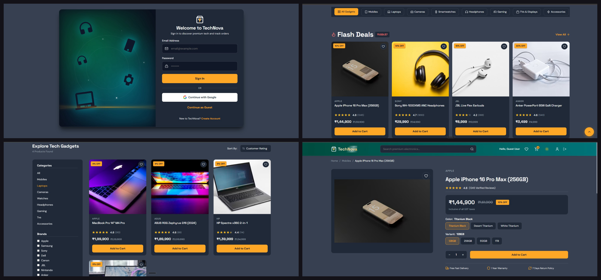

<div align="center">
  <h1>TechNova 🚀</h1>
  <p><strong>A Premium, High-Performance E-Commerce Single Page Application</strong></p>
  
  [](https://diva1516.github.io/Tech_Nova/)
  []()
  []()
  []()
</div>

## 📖 Overview
TechNova is a modern, fully responsive e-commerce web application built from the ground up using **React 18** and **Vite**. It features a custom-built "glassmorphism" design system, complex global state management using the React Context API, and dynamic URL synchronization for advanced product filtering.

## ✨ Key Features
- **🛍️ Advanced State Management:** Global synchronization of Shopping Cart, Wishlist, and User Authentication without prop-drilling, utilizing customized Context APIs.
- **🔗 Deep-Link Filtering:** Product categories, search queries, and active filters are dynamically synchronized with URL parameters for shareable states.
- **🎨 Premium UI/UX:** Custom CSS3 architecture featuring a dark-themed glassmorphism aesthetic, smooth micro-interactions, and 100% mobile-first responsiveness.
- **⚡ Blazing Fast Routing:** Client-side routing powered by React Router v6, optimized for zero page reloads and smooth transitions.
- **🔒 Simulated Authentication:** Role-based access control protecting user profile and checkout routes.

## 📸 Previews
<div align="center">
  
</div>

### Conceptual Architecture
<div align="center">
  
  
</div>

## 🛠️ Tech Stack
- **Frontend Framework:** React.js (v18)
- **Build Tool:** Vite
- **Routing:** React Router DOM (v6)
- **Styling:** Vanilla CSS3 (Custom Variables, CSS Grid/Flexbox)
- **Icons:** Lucide React
- **Deployment:** GitHub Pages (Automated CI/CD via GitHub Actions)

## 🚀 Getting Started

To run this project locally, follow these steps:

1. **Clone the repository**
   ```bash
   git clone https://github.com/Diva1516/Tech_Nova.git
   ```
2. **Navigate to the directory**
   ```bash
   cd Tech_Nova
   ```
3. **Install dependencies**
   ```bash
   npm install
   ```
4. **Start the development server**
   ```bash
   npm run dev
   ```

## 👨‍💻 Author
**Divakaran G**
- 💼 [LinkedIn](https://linkedin.com/in/divakaran11)
- 🌐 [Portfolio](https://divakaran-g-portfolio.netlify.app)
- 🐙 [GitHub](https://github.com/Diva1516)
